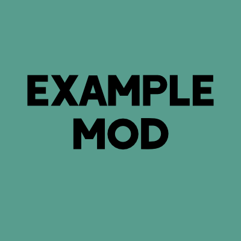

# Rift Example Mod

*Start out with Rift!*

**This mod template is open source and under a permissive license.** As such, it can be used in any way and to start any project without prior permission. See the [LICENSE file](LICENSE) for more details.

This is a template for starting a Rift mod. It contains everything you need for starting a simple project, either in Java or Kotlin.

## Setup

First, download this repository as a ZIP. Rename the folder, and decide what language you are going to write your mod in.

If you want to write in Java, delete the /src/main/kotlin folder, along with lines [28](https://github.com/Boundarybreaker/ExampleMod/blob/master/build.gradle#L28) and [33](https://github.com/Boundarybreaker/ExampleMod/blob/master/build.gradle#L33) from your build.gradle.

If you want to write in Kotlin, delete the /src/main/java folder.

If you don't plan to use mixins, delete the `mixins` folder and the `ExampleModCore` class, along with lines [9](https://github.com/Boundarybreaker/ExampleMod/blob/master/build.gradle#L9), [14](https://github.com/Boundarybreaker/ExampleMod/blob/master/build.gradle#L14), and [36-39](https://github.com/Boundarybreaker/ExampleMod/blob/master/build.gradle#L36-L39) of your build.gradle. Also remove line [9](https://github.com/Boundarybreaker/ExampleMod/blob/master/src/main/resources/riftmod.json#L9) in `src/main/resources/riftmod.json`. **NOTE: If you do this, many line numbers referenced below may be different. Click through the links to see the contents of each line before deleting anything.**

Now, start renaming. Make all these changes:

- Rename the `com`, `example`, and `examplemod` folders in your language's folder to your identifier and namespace for the mod. For example, my [Aquarius](https://github.com/Boundarybreaker/Aquarius) mod has the folders `space`, `bbkr`, and `aquarius`.

- Rename the `src/main/resources/assets/examplemod` and `src/main/resources/data/examplemod` folders to your namespace.

- While you're in resources, edit your `riftmod.json` to add all the information for your mod, the `pack.mcmeta` for your short mod description,  rename `mixins.examplemod.json` to `mixins.<namespace>.json`, and rename `mixins.examplemod.refmap.json` to `mixins.<namespace>.refmap.json`. You don't need to create the `mixins.<namespace>.refmap.json` file yourself; Mixin will do this automatically when you use the mod.

- Rename your project on lines [17](https://github.com/Boundarybreaker/ExampleMod/blob/master/build.gradle#L17) and [19](https://github.com/Boundarybreaker/ExampleMod/blob/master/build.gradle#L19) of your build.gradle, along with the mixin refmap filename on line [38](https://github.com/Boundarybreaker/ExampleMod/blob/master/build.gradle#L38), if you have it still.

- Replace the first line in every class (`ExampleMod`, `ExampleModCore`, `BlockExample`, and `TileEntityExample`) to have the proper path naim after `src/main/<language>`.

- Start renaming the files, making sure both the file name and the name inside the file match. Replace `Example` with whatever you want your mod to be called.
    - Use Eclipse or Idea's "Refactor" options to rename all the files quickly and easily.

- Replace the `icon.png` and `src/main/resources/pack.png` images with your project's icon. `icon.png` should be 400x400 px for uploading to Curse, and `pack.png` should be 128x128 for appearing in game.

## Start a Development Environment

Once you've completed all these changes, you should be ready to get a development environment ready.

Open a command prompt in the root folder of your project. There, run `gradlew setupDevWorkspace <eclipse/idea>`, based on your IDE. If you are on MacOS or Linux, you will need to run `/gradlew setupDevWorkspace <eclipse/idea>`.

This will set up the project so your IDE can properly understand it and use the minecraft code. Next, import the build.gradle as a project into your IDE.

Lastly, if you want to upload your work to a git repository, import the root folder into your git client. This repository comes with a `gitignore` file designed for developing mods without uploading too many extra files.

With this, you should be ready to start your mod! Remember to rename variables as you change them into new objects, and delete anything you don't need.
